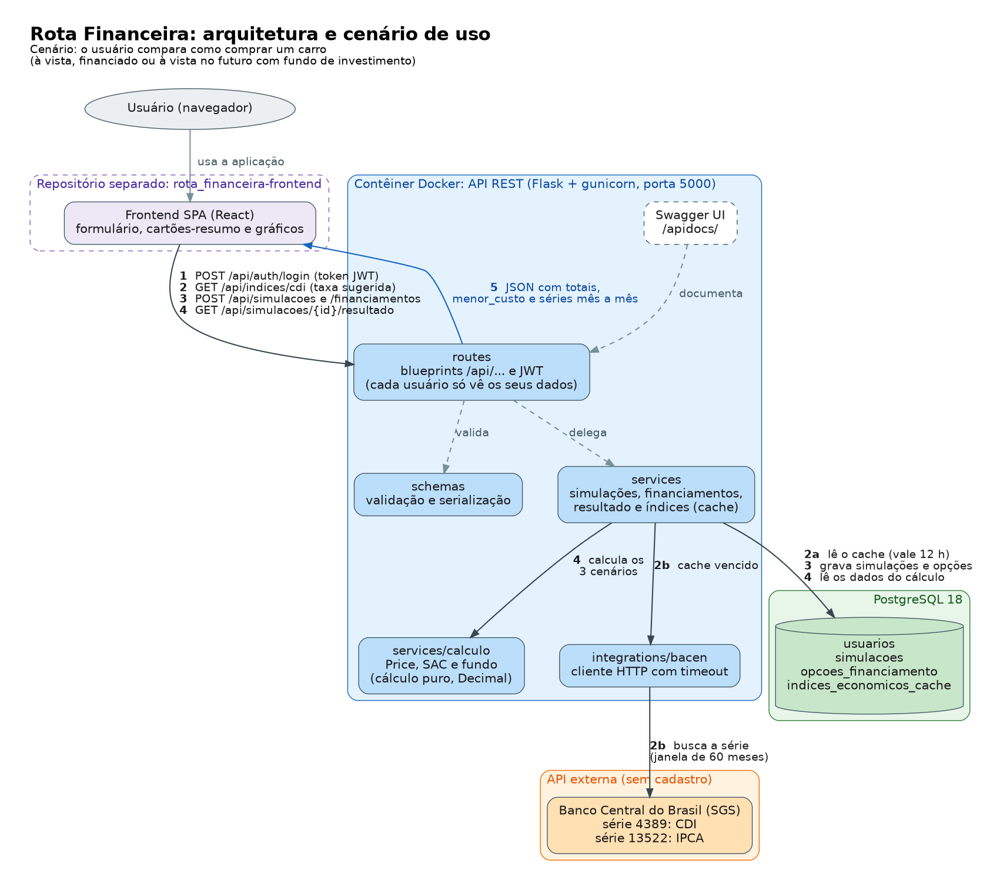

# Rota Financeira — Frontend

SPA em React do **Comparador de Cenários para Compra de Carros**: ajuda a decidir *como* comprar um carro,
comparando três cenários lado a lado, com taxas reais do Banco Central:

1. Compra à vista.
2. Compra financiada (2 ou 3 opções, sistemas Price e SAC).
3. Compra à vista **no futuro**, juntando o valor num fundo de investimento (preço do carro corrigido pelo
   IPCA).

Este repositório contém **só o frontend**. O cálculo financeiro (Price, SAC, fundo, correção pelo IPCA, menor
custo) é todo feito pela [API REST em Flask](https://github.com/erbraga/rota_financeira-backend), outro
repositório — a SPA só formata e exibe o que a API devolve, nunca calcula nada por conta própria.

## Funcionalidades

- Registro e login, com sessão JWT.
- Histórico de simulações: criar, editar e excluir.
- Até 3 opções de financiamento por simulação (Price ou SAC), com validação alinhada ao backend.
- Taxas sugeridas do Banco Central (CDI e IPCA), preenchidas automaticamente no formulário.
- Tela de resultado: cartões-resumo com o menor custo em destaque e um gráfico comparativo (saldo devedor ×
  saldo do fundo × preço corrigido, mês a mês).
- Tabela de amortização de cada opção, com gráfico de barras (amortização × juros).
- Simulação de aporte mensal no fundo ("e se eu guardar X por mês?"), direto pela URL.
- Feedback visual completo: estados de carregamento, erro (com "Tentar de novo") e vazio em toda tela que
  depende da API; avisos de sucesso; fronteiras de erro que nunca deixam a tela em branco.

## Arquitetura e cenário de uso



O cenário ilustrado: **login → taxas sugeridas → criar simulação e opções de financiamento → resultado**. O
frontend (este repositório) só conversa com a API REST do backend; o PostgreSQL e o Banco Central (SGS) ficam
inteiramente do lado do backend, que os acessa e devolve tudo já calculado. A fonte do diagrama
(`docs/img/arquitetura.dot`) usa [Graphviz](https://graphviz.org/), que é só uma ferramenta de desenho — não é
uma dependência do projeto.

## Tecnologias

React 19 + Vite · React Router · TanStack Query (React Query) · React Hook Form + Zod · Material UI · Recharts
· `fetch` nativo (client HTTP próprio, sem Axios) · Vitest + React Testing Library + MSW (testes).

## Pré-requisitos

- [Node.js 24](https://nodejs.org/) (a versão exata está em `.nvmrc`) e npm.
- A [API do backend](https://github.com/erbraga/rota_financeira-backend) rodando — este repositório não
  funciona sozinho, pois todo o cálculo e a persistência ficam lá. Siga o README do backend para instalá-la e
  subi-la (tipicamente em `http://localhost:5000`).

## Instalação e execução local

Os comandos abaixo são de
**Linux/macOS (bash)**; no Windows, use o **WSL** ou siga apenas o caminho [Executar com Docker](#executar-com-docker),
que não depende do shell.


```bash
npm install
cp .env.example .env
npm run dev
```

A SPA abre em `http://localhost:5173`. Sem o backend no ar, as telas mostram erro de rede (com "Tentar de
novo") ao tentar carregar dados — a interface em si abre normalmente.

## Variável de ambiente

| Variável | Descrição |
|---|---|
| `VITE_API_URL` | URL base da API do backend, **incluindo `/api`** (ex.: `http://localhost:5000/api`). |

`VITE_API_URL` é lida **em tempo de build**: o Vite a embute no código publicado, então mudar o valor exige
rodar `npm run build` (ou reconstruir a imagem Docker) de novo. Como o valor vai para o bundle público, nunca
coloque um segredo nele — só a URL da API.

## Scripts disponíveis

| Script | O que faz |
|---|---|
| `npm run dev` | Sobe o servidor de desenvolvimento (porta 5173). |
| `npm run build` | Gera o build de produção em `dist/`. |
| `npm run preview` | Serve o build de produção localmente, para conferência (porta 3000). |
| `npm run lint` | ESLint, sem tolerância a avisos. |
| `npm test` | Roda a suíte de testes uma vez (Vitest). |
| `npm run test:watch` | Roda a suíte em modo observador. |

## Executar com Docker

```bash
docker build --build-arg VITE_API_URL=http://localhost:5000/api -t rota-financeira-web .
docker run -d --name rota-financeira-web -p 8080:8080 rota-financeira-web
```

A imagem é multi-stage: builda a SPA com Node e serve o resultado estático com nginx, numa imagem só de
produção (sem `node_modules`, código-fonte ou segredo). Abre em `http://localhost:8080`; recarregar uma rota
interna (ex.: `http://localhost:8080/simulacoes`) funciona normalmente — o nginx tem o fallback de SPA
configurado. Para o app funcionar de ponta a ponta pelo contêiner, o `CORS_ORIGINS` do backend precisa incluir
`http://localhost:8080`.

## Telas e rotas

Todas as telas, exceto registro, login e a página de erro 404, exigem sessão.

| Tela | Rota | Função |
|---|---|---|
| Registro | `/registrar` | Cria a conta |
| Login | `/login` | Autentica e guarda a sessão |
| Minhas simulações | `/simulacoes` | Histórico: abrir, editar e excluir |
| Nova / editar simulação | `/simulacoes/nova`, `/simulacoes/:id/editar` | Dados do veículo, do fundo e as opções de financiamento |
| Resultado | `/simulacoes/:id/resultado` | Comparação dos três cenários, com cartões e gráfico |
| Amortização | `/simulacoes/:id/financiamentos/:fid` | Tabela mês a mês de uma opção de financiamento |

Fluxo principal: login → criar simulação (com as taxas já sugeridas) → adicionar 2 ou 3 opções de
financiamento → ver o resultado comparativo → revisitar pelo histórico.

## Endpoints consumidos

Todos sob `/api`, com `Authorization: Bearer <token>` depois do login:

- `POST /api/auth/registrar`, `POST /api/auth/login`, `GET /api/auth/perfil`
- `GET`, `POST /api/simulacoes`; `GET`, `PUT`, `DELETE /api/simulacoes/:id`
- `GET`, `POST /api/simulacoes/:id/financiamentos`; `PUT`, `DELETE /api/simulacoes/:id/financiamentos/:fid`
- `GET /api/simulacoes/:id/resultado` (aceita `?aporte_mensal=`)
- `GET /api/simulacoes/:id/financiamentos/:fid/parcelas`
- `GET /api/indices/cdi`, `GET /api/indices/ipca` (aceitam `?periodo=`)

O contrato completo (formatos, mensagens de validação, códigos de erro) é documentado no Swagger do backend.

## Estrutura de pastas

```
src/
  api/          # client HTTP e as funções que chamam cada endpoint
  auth/         # sessão (contexto, token, rota protegida)
  avisos/       # avisos de sucesso (Snackbar)
  components/   # componentes de apresentação e diálogos
  hooks/        # hooks de dados (React Query) por recurso
  pages/        # uma tela por rota
  schemas/      # validação dos formulários (Zod) e conversão para o formato da API
  utils/        # formatação, leitura de número em pt-BR, mensagens de erro
  mocks/        # servidor MSW e fixtures, usados só nos testes
docs/           # specs do projeto e imagens (fluxograma da arquitetura)
```

## O frontend não calcula nada financeiro

Price, SAC, o fundo, a correção pelo IPCA, os totais, o menor custo e as séries mês a mês vêm todos prontos do
backend — a SPA só formata (reais, porcentagem, datas) e exibe. Nenhuma aritmética financeira acontece no
código deste repositório.

## Testes

```bash
npm test
```

1591 testes (Vitest + React Testing Library + MSW), cobrindo componentes, hooks, formulários e o client HTTP.
Os mocks (MSW) só valem para os testes automatizados — não há um modo de "rodar a SPA sem backend" no
navegador; para isso, o backend real precisa estar no ar.

## Autoria

Projeto acadêmico desenvolvido por [Emerson Range Braga](https://github.com/erbraga) na pós-graduação em
Desenvolvimento Full Stack da PUC-Rio.
